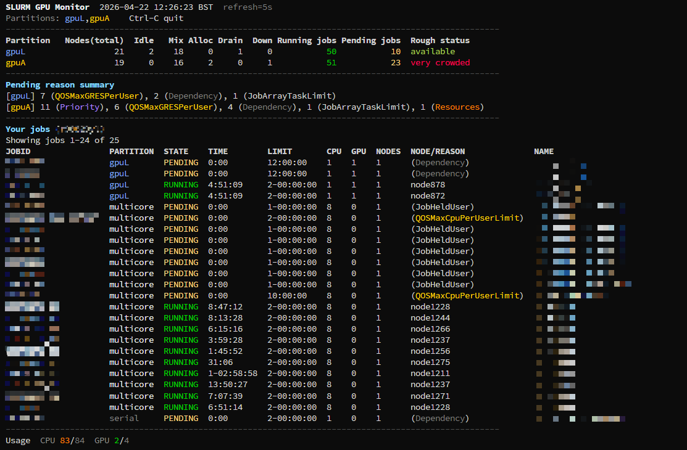

# UoM Slurm GPU Monitor

`gpuq` is a lightweight Slurm dashboard for the University of Manchester HPC environment. It is designed for users who want a compact, low-overhead view of GPU queue pressure and their own active jobs without repeatedly running `squeue` by hand.



The tool focuses on a narrow operational workflow:

- monitor `gpuL` and `gpuA` with a fixed refresh interval
- inspect pending reasons at partition level
- track your own jobs in the same view
- surface current CPU and GPU usage against quota

The live dashboard intentionally favors stability over interactivity. It uses a read-only refresh model that behaves predictably on shared login nodes and avoids pretending to be a full terminal UI.

## Features

- live Slurm summary for `gpuL` and `gpuA`
- Monokai-oriented terminal color scheme
- partition-level pending reason summaries
- per-user job table showing:
  - partition
  - state
  - elapsed time
  - time limit
  - CPU count
  - GPU count
  - node or pending reason
  - job name
- current `CPU used / quota` and `GPU used / quota`
- one-shot full snapshot mode via `gpuq --view`

## Requirements

The script expects the following commands to be available on the target system:

- `bash`
- `squeue`
- `sinfo`
- `sacctmgr`
- `awk`
- `column`
- `sort`
- `date`
- `id`
- `perl`
- `tput`
- `less`
- `mktemp`
- `stty`

This project targets Slurm-based HPC systems and is tuned for the UoM environment. It is not intended to be a generic cluster monitoring framework.

## Installation

Clone the repository and run:

```bash
./install.sh
```

The installer will:

- copy `bin/gpuq` to `~/bin/gpuq`
- mark the script as executable
- add a shell wrapper to `~/.bashrc` if one is not already present

The wrapper is:

```bash
gpuq() { bash "$HOME/bin/gpuq" "$@"; }
```

This is deliberate. On some HPC filesystems, direct execution from home directories can be unreliable, while `bash ~/bin/gpuq` is stable.

After installation:

```bash
source ~/.bashrc
gpuq
gpuq 3
gpuq --view
```

## Usage

```text
gpuq
gpuq 3
gpuq -n 3
gpuq --view
```

- `gpuq` refreshes every 5 seconds
- `gpuq 3` refreshes every 3 seconds
- `gpuq -n 3` is equivalent to `gpuq 3`
- `gpuq --view` opens a single full snapshot in `less -R`

## Output Overview

The live view is organized into three sections:

1. Partition summary for `gpuL` and `gpuA`, including node states, running jobs, pending jobs, and a rough congestion label.
2. Pending reason summary, grouped by partition.
3. A `Your jobs` table followed by current `CPU / GPU` usage against quota.

The congestion label is a heuristic derived from node states and pending job counts. It should be treated as an operational hint, not a scheduler guarantee.

## Design Notes

- The live dashboard is intentionally read-only.
- Previous input-heavy live interaction was removed because terminal behavior was inconsistent across frontends.
- The redraw path clears each printed line explicitly to avoid stale text after shorter updates.
- The dashboard aims to be informative while remaining light enough for shared login nodes.

## Repository Layout

```text
bin/gpuq        Main dashboard script
install.sh      Local installer for ~/bin and ~/.bashrc
tests/smoke.sh  Minimal syntax and CLI smoke checks
```

## Smoke Test

Run:

```bash
./tests/smoke.sh
```

This performs shell syntax validation and a small set of safe non-interactive checks.

## License

Released under the MIT License.
