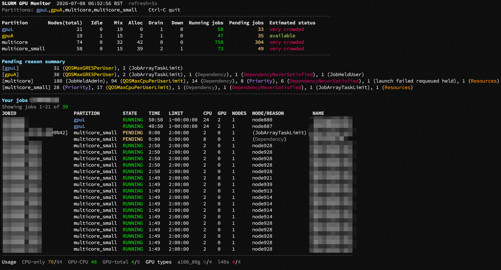

# UoM Slurm GPU Monitor

`gpuq` is a lightweight Slurm dashboard for the University of Manchester HPC environment. It gives users a compact live view of GPU queue pressure, pending reasons, personal jobs, and current CPU and GPU usage.



## Features

- Live partition summary for `gpuL`, `gpuA`, `multicore`, and `multicore_small`
- Monokai oriented terminal colours
- Partition level pending reason summary
- Personal job table with partition, state, elapsed time, time limit, CPU count, GPU count, node or reason, and job name
- CPU only usage, GPU job CPU usage, total GPU usage, and GPU type usage
- One shot full snapshot mode through `gpuq --view`

## Requirements

The target system needs `bash`, `squeue`, `sinfo`, `sacctmgr`, `awk`, `column`, `sort`, `date`, `id`, `perl`, `tput`, `less`, `mktemp`, and `stty`.

The project targets Slurm based HPC systems and follows the partition and QoS naming used in the UoM environment.

## Installation

Clone the repository, then run

```bash
./install.sh
```

Installer actions

- Copy `bin/gpuq` to `~/bin/gpuq`
- Mark the script as executable
- Add a shell wrapper to `~/.bashrc` when needed

The installed shell wrapper is

```bash
gpuq() { bash "$HOME/bin/gpuq" "$@"; }
```

The wrapper keeps execution stable on HPC filesystems where direct execution from home directories can be unreliable.

After installation

```bash
source ~/.bashrc
gpuq
gpuq 3
gpuq --view
```

## Usage

```text
gpuq
gpuq 3
gpuq -n 3
gpuq --view
```

- `gpuq` refreshes every 5 seconds
- `gpuq 3` refreshes every 3 seconds
- `gpuq -n 3` refreshes every 3 seconds
- `gpuq --view` opens one full snapshot in `less -R`

## Output

The live view has three sections.

1. Partition summary for `gpuL`, `gpuA`, `multicore`, and `multicore_small` with node states, running jobs, pending jobs, and estimated status
2. Pending reason summary grouped by partition
3. Personal job table followed by CPU only usage, GPU job CPU usage, total GPU usage, and GPU type usage

The estimated status is a heuristic based on node states and pending job counts. Use it as an operational hint for quick reading.

## Design Notes

- Live mode uses a read only refresh loop
- Input heavy controls were removed after terminal behaviour proved inconsistent across frontends
- Each redraw clears printed lines to prevent stale text after shorter updates
- Divider width follows the main tables to keep panel boundaries aligned

## Repository Layout

```text
bin/gpuq        Main dashboard script
install.sh      Local installer for ~/bin and ~/.bashrc
tests/check.sh  Validation script
```

## Validation

Run

```bash
./tests/check.sh
```

This validates shell syntax and safe non interactive paths.

## License

Released under the MIT License.
